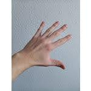
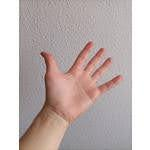
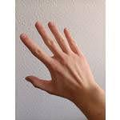

# Hand Position Classification System

## Project Description

The project consists of a hand position classification system in images. The classified hand positions are: LF (Left Front), LB (Left Back), RF (Right Front), and RB (Right Back). The system uses a pre-trained convolutional neural network (VGG16) to extract features from the images and a dense neural network for classification.

## Image Examples

Here, sample images are provided that showcase different hand positions (LF, LB, RF, RB) and have been utilized to train the model:

  <table>
    <tr>
      <td align="center"> <em>LB</em></td>
      <td align="center"> <em>LF</em></td>
    </tr>
    <tr>
      <td align="center"> <em>RB</em></td>
      <td align="center"> <em>RF</em></td>
    </tr>
  </table>

